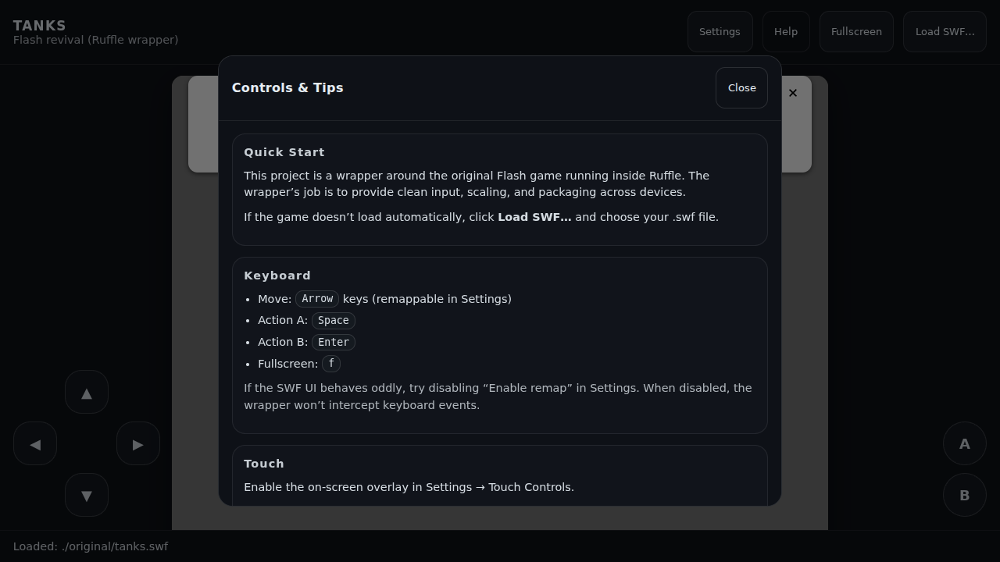

# TanksFlashMobile

Fan project to bring back the classic Flash game **TANKS** (a Scorched Earth–style artillery game) on modern platforms:

- Web (baseline)
- Android + iOS (wrapped web build)
- Windows (desktop wrapper or PWA)



## Status

This repo is in early setup, but the web wrapper is already scaffolded under `apps/web`.

The actionable backlog lives in `TODO.md`.

CI note:
- Pull Requests publish build artifacts to GitHub Actions (web `dist/`, Windows installer/zip, Android debug APK). See the workflow run’s “Artifacts” section.

## Downloads

Preferred: **GitHub Releases** (created on version tags like `v0.1.0`).

What you’ll see attached to a Release:
- Web: `Tanks-<tag>-web-dist.zip`
- Web remake (Canvas/TS): `Tanks-<tag>-remake-web-dist.zip`
- Remake (Godot): `Tanks-<tag>-remake-godot-windows.exe`, `Tanks-<tag>-remake-godot-linux.x86_64`, `Tanks-<tag>-remake-godot-macos.zip`
- Windows: `Tanks-<tag>-windows-setup.exe` and `Tanks-<tag>-windows-portable.zip`
- Android: `Tanks-<tag>-android-debug.apk`
- Android (signed, optional): `Tanks-<tag>-android-release.apk` and `Tanks-<tag>-android-release.aab` (requires keystore secrets)
- iOS (Simulator): `Tanks-<tag>-ios-simulator-app.zip` (macOS + Simulator only; no App Store signing)

If there are no Releases yet, use **GitHub Actions artifacts** instead:
- `web-dist`, `remake-web-dist`, `godot-windows`, `godot-linux`, `godot-macos`, `desktop-windows`, `android-debug-apk`, `ios-simulator-app`

Install/run quick notes:
- Web: unzip and serve the folder (e.g. `python3 -m http.server`), then open the URL and use **Load SWF…**.
- Windows: run the setup `.exe`, or unzip the portable build and run `Tanks.exe`.
- Android: install the `.apk` on-device (you may need to allow “Install unknown apps”).
- iOS (Simulator): unzip, then install to a running Simulator (e.g. `xcrun simctl install booted App.app`).

SWF note:
- Releases/artifacts **do not** include the original game SWF. Use the in-app **Load SWF…** button or place it at `assets/original/tanks.swf` for local dev.

Maintainers note (version tags):
- Bump `VERSION`, run `npm run sync:versions`, commit, then tag `v<same-version>` and push the tag.
- The Release workflow verifies the tag matches `VERSION` before publishing artifacts.

## Quick start (web)

```bash
cd apps/web
npm install

# Optional: copy a local SWF into the dev server path
npm run sync:swf

npm run dev
```

Then open the printed local URL.

Notes:
- If your SWF lives somewhere else, you can import it into `assets/original/` (gitignored) via:
  - `npm run swf:import -- --from /path/to/tanks.swf`
- If you don’t have `assets/original/tanks.swf`, you can still use the **Load SWF…** button in the UI.
- Fullscreen: button or press `f`
- Touch overlay: Settings → Touch Controls (auto-defaults on coarse pointers)
- Gamepad: Settings → Gamepad (configure buttons + deadzone; defaults map to Space/Enter)
- Controls & tips: click **Help**

### Smoke test

```bash
cd apps/web
npm run build
npm run test:smoke
```

### Playwright choreography (optional)

For a tighter local dev loop (runs the bundled Playwright client and suppresses the Node ESM warning):

```bash
# In another terminal:
npm --prefix apps/web run dev

# Then:
node scripts/run_web_game_client.mjs --url http://127.0.0.1:5173 --actions-file "$HOME/.codex/skills/develop-web-game/references/action_payloads.json" --iterations 1 --pause-ms 250 --screenshot-dir output/web-game
```

## About assets / legality

This repo intentionally **does not** commit the original Flash binary or archive artifacts.

If you have a legal copy for personal use, place it at:

- `assets/original/tanks.swf`

That path is gitignored so it won’t be committed by accident.

## Likely technical approach

Start with a web wrapper that runs the SWF via **Ruffle** (WebAssembly), then package:

- Mobile: Capacitor (or similar)
- Desktop: Tauri/Electron or PWA

See `docs/MOBILE_WRAPPER.md` for Android/iOS build steps.
See `docs/DESKTOP_WRAPPER.md` for the Windows desktop wrapper (Electron).

If Ruffle compatibility isn’t good enough for the full game, we can pivot to a full reimplementation using a cross‑platform engine (e.g., Godot).

## Remake spikes (clean-room)

In parallel with the wrapper track, the repo contains two clean-room remake prototypes:

- Godot spike: `apps/remake-godot/` (docs: `docs/REIMPLEMENTATION_GODOT.md`)
- Web spike (Canvas/TS): `apps/remake-web/` (docs: `docs/REIMPLEMENTATION_WEB.md`)

## License

MIT for this repo’s original code (see `LICENSE`). Third-party attributions live in `THIRD_PARTY_NOTICES.md`.
